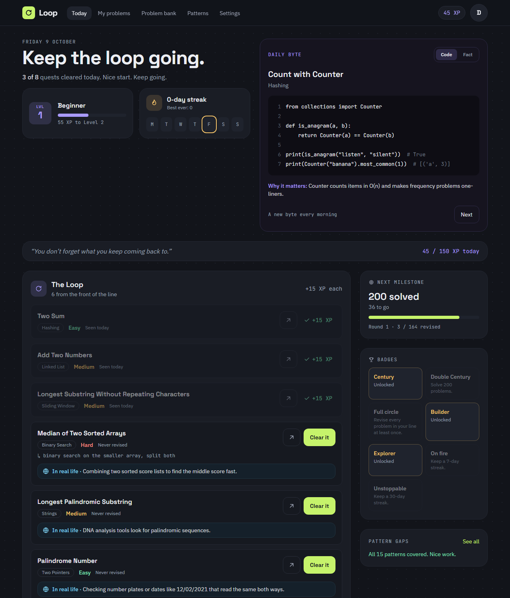
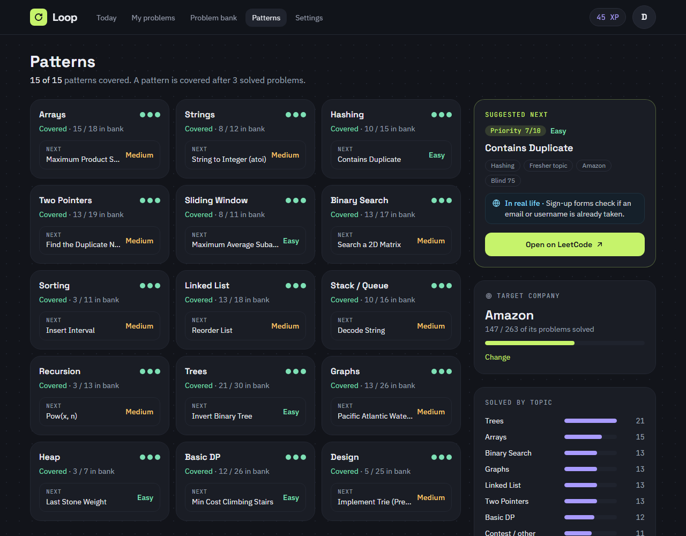
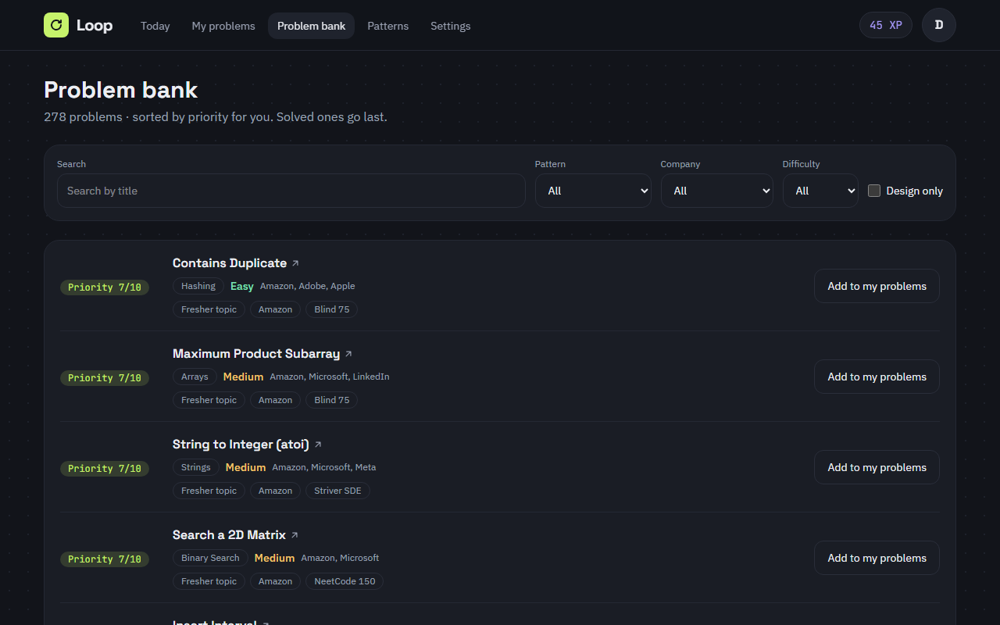
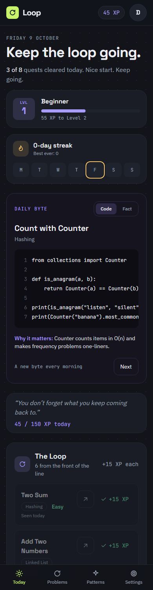

# Loop

**A DSA interview prep app that makes sure you never forget a problem you solved.**

Loop puts every problem you have solved into a round robin line, so each one comes back about once a month.
It picks the right new problems for you with a priority score, and keeps you going with XP, levels, streaks and badges.

**Live app:** _link added after the first deploy_



## Features

- **Round robin revision.** All solved problems wait in one line. Each day you get `ceil(problems / round_days)` from the front. Clear one and it moves to the back. Miss a day and nothing is lost.
- **Warm-up.** A problem you solved yesterday comes back once the next day, before it joins the line.
- **Smart new problems.** Every unsolved problem gets a priority score (fresher topic, target company, famous lists, design, pattern gaps). The reasons are shown as tags.
- **XP, levels, streaks and badges.** Warm-up +10, Loop +15, New +30 XP. 10 levels. The streak grows only on days you clear everything.
- **Daily Byte.** A short Python snippet or a true DSA fact every day.
- **"In real life" box.** Every problem says where it is used in real apps (Splitwise, Spotify, Google Maps ...).
- **Patterns and stats.** 15 core patterns (covered at 3 solved), solved-by-topic bars, round progress, next milestone.
- **Works on a phone.** One-column layout with a bottom tab bar.

| Patterns | Problem bank | Phone |
|---|---|---|
|  |  |  |

## Tech stack

| Part | Tools |
|---|---|
| Backend | Python 3.12, FastAPI, SQLAlchemy 2, Alembic, PostgreSQL 16, JWT (python-jose), passlib/bcrypt, Pydantic v2 |
| Frontend | React 19, Vite, TypeScript, Tailwind CSS v4, React Router |
| Tests | pytest (177 tests, real Postgres), Vitest + Testing Library (43 tests) |
| Run / deploy | Docker, docker-compose, Render (API + Postgres), Vercel (frontend) |

## How the round robin works

```
line (oldest revision first):  [A] [B] [C] [D] [E] [F] ...
today, round = 30 days, 164 problems  ->  ceil(164 / 30) = 6 problems
clear A  ->  A.last_revised_on = today  ->  A is now at the back of the line
```

- The line is sorted by `last_revised_on` (never revised first, then oldest), then by id.
- A problem cleared today stays on today's list (marked done), so no extra problem slides in.
- If the daily count is more than your daily limit, Loop warns you to make the round longer or retire easy problems.
- Code: [`backend/app/services/queue.py`](backend/app/services/queue.py)

## How new problems are picked

| Rule | Points |
|---|---|
| Fresher topic (Arrays, Strings, Hashing, Binary Search, Sorting) | +3 |
| Your target company asks it | +3 |
| In 2 or more famous lists (Blind 75, NeetCode 150, Striver SDE ...) | +2 |
| Easy or Medium | +2 |
| Design problem (build a data structure) | +3 |
| You solved fewer than 3 in this pattern | +2 |
| Hard | -2 |

Highest score first (max 15, shown as "Priority X/10"). Ties: Easy before Medium before Hard.
Code: [`backend/app/services/priority.py`](backend/app/services/priority.py)

## Run locally

You need Docker, Node.js 20+ and (for running backend tests) Python 3.12+.

```bash
# 1. Backend + database (creates tables, loads the 278-problem bank and the daily bytes)
docker compose up --build

# 2. Frontend, in a second terminal
cd frontend
npm install
npm run dev          # open http://localhost:5173
```

- API docs: http://localhost:8000/docs
- The Docker database is on port **5433** on your machine, so it does not clash with a local Postgres.
- Register in the app, then use **My problems → Import CSV** with `backend/data/my_solved.csv` (or any CSV with the same columns).

### Backend without Docker

```bash
cd backend
python -m venv venv
venv\Scripts\activate             # Windows   (Mac / Linux: source venv/bin/activate)
pip install -r requirements-dev.txt
copy .env.example .env            # Windows   (Mac / Linux: cp)
docker compose up -d db           # only the database
alembic upgrade head
python -m scripts.import_bank
python -m scripts.import_bytes
uvicorn app.main:app --reload
```

### Tests

```bash
cd backend && pytest              # needs the database: docker compose up -d db
cd frontend && npm test
```

Backend tests use their own `loop_test` database and fixed dates (never the real clock).

## Deploy

**Backend + database on Render** (uses [`render.yaml`](render.yaml)):

1. Render dashboard → **New → Blueprint** → pick this repo → **Apply**. It creates `loop-db` (Postgres) and `loop-api` (Docker).
2. Render asks for `CORS_ORIGINS`. Put your Vercel address there (step 5), e.g. `https://loop-xyz.vercel.app`. You can fill it in later under the service's **Environment** tab.
3. Wait for the deploy. `https://<your-api>.onrender.com/health` should show `{"status":"ok"}`.

On every start the API runs the migrations and loads the problem bank and daily bytes (safe to repeat).
`JWT_SECRET` is generated by Render.

**Frontend on Vercel:**

4. Vercel → **Add New → Project** → import this repo → set **Root Directory** to `frontend`.
5. Add the environment variable `VITE_API_URL` = your Render API address (no `/` at the end) → **Deploy**.
6. Put the Vercel address into `CORS_ORIGINS` on Render (step 2) if you have not yet.

Free plan notes: the Render free API sleeps after some time without visits, so the first request can take up to about a minute. Render's free Postgres is time-limited; check Render's current pricing page.

## API

All routes except `/auth/*` and `/health` need `Authorization: Bearer <token>`.

| Method | Path | What it does |
|---|---|---|
| POST | `/auth/register`, `/auth/login` | Create an account, get a JWT |
| GET | `/auth/me` | The logged-in user |
| GET | `/today` | Warm-up, Loop and New quests for today |
| POST | `/my/problems/{id}/done` | Clear a problem → XP, level, streak, new badges |
| POST | `/my/problems/{id}/retire` | Take a problem out of the loop |
| GET, POST | `/my/problems` | List (filters) or add a solved problem |
| PUT, DELETE | `/my/problems/{id}` | Edit the 1-line note, or delete |
| POST | `/my/problems/import` | Upload a solved-list CSV |
| GET | `/bank`, `/bank/{slug}` | Browse the 278 problems (filters, `sort=priority`) |
| GET | `/suggest` | Top new problems with score and reasons |
| GET | `/me/progress`, `/badges` | XP, level, streak, week, round; badges |
| GET | `/patterns`, `/stats` | Pattern checklist; stats and milestones |
| GET | `/byte/today` | Daily Byte (`type=code\|fact`, `offset` for "Next") |
| GET, PUT | `/settings` | Round days, daily limit, new per day, target company |

## Project structure

```
backend/
  app/
    routers/    one file per API area
    services/   queue.py (round robin), priority.py, xp.py, badges.py, byte.py, importer.py
    models/     SQLAlchemy tables      schemas/  Pydantic models      core/  JWT + auth
  alembic/      migrations
  data/         problem_bank.csv (278), my_solved.csv, daily_bytes.csv (30)
  scripts/      CSV import commands
  tests/        pytest
frontend/
  src/api/        fetch client (adds the JWT) + one file per resource
  src/pages/      Login, Today, MyProblems, Bank, Patterns, Settings
  src/components/ Nav, BottomTabs, quest rows, cards, Daily Byte ...
  src/theme/      colours and fonts (Tailwind v4 @theme)
render.yaml       Render blueprint (API + Postgres)
```

Company tags in the problem bank are estimates, not official data.
